### VINS-Mono

------

### 环境

- 小鱼ROS：

  ```
  wget http://fishros.com/install -O fishros && . fishros
  ```


------

### 调试

1. src/VINS-Mono/camera_model/src/calib/CameraCalibration.cc

   ```c++
   //适配opencv4,解决error: ‘CV_XXX’ was not declared in this scope
   #define CV_GRAY2RGB (cv::COLOR_GRAY2RGB)
   #define CV_AA (cv::LINE_AA)
   ```

   

2. src/VINS-Mono/camera_model/src/chessboard/Chessboard.cc

   ```c++
   //适配opencv4,解决error: ‘CV_XXX’ was not declared in this scope
   #define CV_GRAY2BGR (cv::COLOR_GRAY2BGR) 
   #define CV_BGR2GRAY (cv::COLOR_BGR2GRAY) 
   #define CV_CALIB_CB_ADAPTIVE_THRESH (cv::CALIB_CB_ADAPTIVE_THRESH ) 
   #define CV_CALIB_CB_NORMALIZE_IMAGE (cv::CALIB_CB_NORMALIZE_IMAGE ) 
   #define CV_CALIB_CB_FILTER_QUADS (cv::CALIB_CB_FILTER_QUADS )
   #define CV_CALIB_CB_FAST_CHECK (cv::CALIB_CB_FAST_CHECK )
   #define CV_ADAPTIVE_THRESH_MEAN_C (cv::ADAPTIVE_THRESH_MEAN_C )
   #define CV_THRESH_BINARY (cv::THRESH_BINARY )
   
   #define CV_SHAPE_CROSS ( cv::MORPH_CROSS )
   #define CV_SHAPE_RECT ( cv::MORPH_RECT )
   #define CV_TERMCRIT_EPS ( cv::TermCriteria::EPS )
   #define CV_TERMCRIT_ITER ( cv::TermCriteria::MAX_ITER )
   #define CV_RETR_CCOMP ( cv::RETR_CCOMP)
   #define CV_CHAIN_APPROX_SIMPLE ( cv::CHAIN_APPROX_SIMPLE)
   #define CV_THRESH_BINARY_INV ( cv::THRESH_BINARY_INV)
   ```

3. src/VINS-Mono/camera_model/src/intrinsic_calib.cc

   ```c++
   //适配opencv4,解决error: ‘CV_XXX’ was not declared in this scope
   #define CV_AA (cv::LINE_AA)
   ```

   

4. src/VINS-Mono/pose_graph/src/ThirdParty/DVision/BRIEF.cpp

   ```c++
   //适配opencv4,解决error: ‘CV_XXX’ was not declared in this scope
   #define CV_RGB2GRAY (cv::COLOR_RGB2GRAY) 
   #define CV_FONT_HERSHEY_SIMPLEX (cv::FONT_HERSHEY_SIMPLEX) 
   ```

5. src/VINS-Mono/pose_graph/src/keyframe.cpp

   ```c++
   //适配opencv4,解决error: ‘CV_XXX’ was not declared in this scope
   #define CV_FONT_HERSHEY_SIMPLEX (cv::FONT_HERSHEY_SIMPLEX) 
   ```

6. src/VINS-Mono/pose_graph/src/pose_graph.cpp

   ```c++
   //适配opencv4,解决error: ‘CV_XXX’ was not declared in this scope
   #define CV_FONT_HERSHEY_SIMPLEX (cv::FONT_HERSHEY_SIMPLEX) 
   ```

------


### 运行

1. 编译（调试报错）

2. 下载数据集[The EuRoC MAV Dataset](https://projects.asl.ethz.ch/datasets/doku.php?id=kmavvisualinertialdatasets#downloads)

3. 在xxx_ws文件夹下打开三个终端，并分别输入：

   - 第一个终端

     ```shell
     source devel/setup.bash
     roslaunch vins_estimator euroc.launch 
     ```

   - 第二个终端

     ```shell
     source devel/setup.bash
     roslaunch vins_estimator vins_rviz.launch
     ```

   - 第三个终端

     ```shell
     source devel/setup.bash
     rosbag play MH_01_easy.bag //后面是数据集的路径
     ```

   - 查看节点间关系（任意终端，新开即可）

     ```shell
     rqt_graph
     ```

     

4. 命令解释[roslaunch命令](https://blog.csdn.net/qq_38364548/article/details/123526774)

   ​	
   


### 论文

#### 	预处理

1. ------

   ##### 视觉前端

   - 特征跟踪：KLT稀疏光流法

   - 特征检测：

     1. 提取特征：

        - 在两个相邻特征之间设置最小间隔以保证均匀分布
        - 每幅图像至少100-300个特征

     2. 去畸变

     3. 外点去除：RANSAC

     4. 投影：投影到一个归一化球面上

        

   - 关键帧选取：

     1. 如果当前帧和最新关键帧之间跟踪的特征点的平均视差超出某个特定阈值，则将该帧视为新的关键帧

        - 平移和旋转都会出现视差，但是只有旋转运动时，特征点无法被三角化（triangulated），因此，使用陀螺仪测量数据进行短时积分来补偿旋转

          [^triangulated]: 三角测量：在不同位置对同一个路标点进行观测，从而推断路标点的距离【14讲，7.5】

        - 这里的旋转补偿仅用于关键帧选取，不参与VINS公式中的旋转计算

        - 在这种情况下，即使陀螺仪存在较大的噪声或者偏置，也只会造成次优的关键帧选择结果，不会直接影响估计结果

          

     2. 如果跟踪的特征数量低于某一阈值，则将此帧视为新的关键帧

   

2. ------

   ##### IMU预积分

   [^参考内容]: 黑体公式编号出自《自动驾驶与机器人中的SLAM》

   

   - IMU噪声和偏置
   
   - IMU预积分
   
     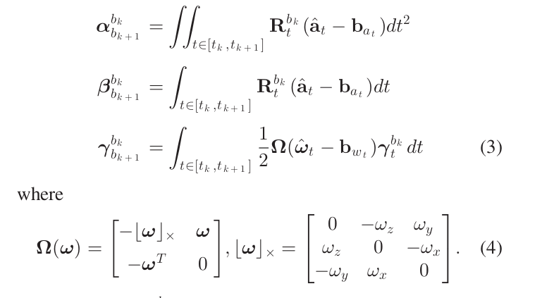
   
     1. α、β、γ分别对应P、V、Q（位置，速度，旋转），在$$t_k $$到$$t_k+1$$内：
        - β的表示和**式4.4b**类似，只不过这里是速度的增量
        - α则是在β的基础上再做一次积分，即可表示这段时间内的位置变化量
        - γ中的$$\frac{1}{2}$$则是由于这里使用四元数表示旋转
   
     2. γ的表达式来历不是很理解
   
        
   
   - 偏置修正
   
     
   
     - α和β的修正和**式4.32**中的p和v对应
   
     - γ的修正和**式4.32**中的R对应，只不过由于是用四元数表示的，所以利用**2.2.3**中的转换技巧，将修正量转换为四元数
   
       [^转换]: $$q = [cos(\frac{\theta}{2}),\vec{n}sin(\frac{\theta}{2})]$$，当$$\theta$$很小时，$$cos(\frac{\theta}{2})\approx1,sin(\frac{\theta}{2})\approx\frac{\theta}{2}$$，这里 的$$\theta$$就是上式中旋转修正量
   
       

​	


#### 估计器初始化

1. ------

   ##### 滑动窗口中的纯视觉sfm

   ​	由于计算复杂度受限，文章在滑动窗口中保留了几个帧。

   1. ​	在最新的帧和滑动窗口中的所有帧中检测特征，如果可以发现超过30个能够稳定跟踪的特征超过20个有效视差像素，则使用五点法恢复这两个帧之间的相对旋转和尺度平移；***否则，我们将最新的帧保存在窗口中，并等待新的帧（原文中没有 “否则...”）***

   2. 任意设置尺度，并对这两个帧中观察到的所有特征进行三角化

   3. 基于这些三角特征，使用一种PnP算法来估计窗口中所有其他帧的姿态

      [^PnP算法]: 求解3D到2D点对运动的方法，描述了当知道n个3D空间点及其投影位置时，如何估计相机的位姿【14讲，7.7，P180】

   4. 使用全局光束平差法（BA）最小化所有的特征重投影误差

      [^BA]: 对PnP问题采取非线性优化的方式，构建最小二乘问题并迭代求解【14讲，7.7，P180；14讲，9.2.2】

      

   5. 由于还没有任何世界坐标系的知识，将相机的第一个帧$$(·)^{c_0}$$设置为SfM的参考帧（reference frame）

   6. 假设相机和IMU之间有一组粗略的外参$$(p^b_c,q^b_c)$$那么可以将位姿从相机坐标系转换到IMU坐标系：

      

      这里的s是一个用于缩放的尺度参数

      

2. ------

   ##### 视觉惯性校准

   基本思路：匹配视觉尺度结构和IMU预积分

   1. 陀螺仪偏置校准：

      考虑窗口中的连续两帧$$b_k$$和$$b_{k+1}$$：

      从视觉SfM中获得旋转$$q^{c_0}_{b_k}$$和$$q^{c_0}_{b_{k+1}}$$，并从IMU中获得相对约束$$\widetilde{\gamma}^{b_k}_{b_{k+1}}$$，对陀螺仪偏置进行预积分线性化，并最小化下面的代价函数：

      

      [^疑问]: **这里的代价函数是怎么出来的**

      

      得到陀螺仪偏置的初始校准后即可更新IMU预积分

      **这里的代价函数是怎么出来的**

   2. 速度、重力向量和尺度初始化：

      

      这里的重力向量使用的是第一帧中的重力向量；s将单目SfM缩放至公制单位

      

      考虑窗口中的连续两帧$$b_k$$和$$b_{k+1}$$：

      

      观察下面的β表达式，可以理解为：先将k+1和k时刻都速度都转换到$$c_0$$时刻进行处理，处理完成之后再还原回k时刻的坐标系下；

      而阿尔法表达式中，括号内部的量本来就在$$c_0$$坐标系下，因此直接在处理完成之后将其转换到k时刻的坐标系即可；

      然后联立（6）和（9），可得到下面的测量模型：

      

      [^疑问]: **这里不是很理解联立过程以及H的推导**

      

      由此测量模型可以抽象出以下最小二乘问题，求解即可得到窗口中每帧的速度、重力向量和尺度参数

      

      

      

   3. 重力细化:

      1. 重力大小通常是已知的，因此只需要对重力的方向进行细化，在正切空间中只需要两个变量即可：

         $$g(\overline{\hat{g}}+\delta\vec{g})$$ ，其中，$$\delta\vec{g}=w_1\vec{b_1}+w_2\vec{b_2}$$

         $$g$$描述了重力大小，后面两个量则修正细化了重力的方向，这里的$$\vec{b_1}，\vec{b_2}$$通过下面的算法找到：

         

         

      2. 将细化后的重力向量加入（9）并求解，不断迭代直到 $$\hat{g}$$​ 收敛（和其他量一起最小二乘）

         

   4. 完成初始化：


#### 紧耦合单目VIO

------

1. ##### 公式

   滑动窗口中的状态向量：

   

   - 其中$x_k$是捕获第k帧图像时的IMU状态，包含：

     - IMU在世界坐标系中的位置、速度和方向

     - IMU本体坐标系中的加速度计偏置和陀螺仪偏置

   - n是关键帧总数

   - m是滑动窗口中的特征总数

   - $$\lambda_l$$是第一次观测到第$$l$$个特征的[逆深度](https://zhuanlan.zhihu.com/p/596069919)

     [^逆深度]: 逆深度是深度的倒数；
     [^为什么是逆深度：1]: 距离变化较大时，逆深度的变化量小，不容易产生较大的梯度，防止优化过程中代价函数对该特征点出现较大的调整
     [^为什么是逆深度：2]: 可以表示出很远的点，并且不会过分的损失精度
     [^为什么是逆深度：3]: 服从高斯分布，且数据稳定性好


   

   使用视觉-惯性BA，最小化所有测量残差的先验和Mahalanobis范数之和，得到最大后验估计：

   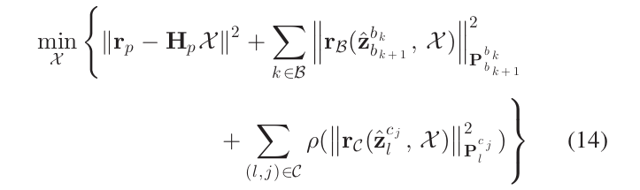

   

   其中，Huber范数定义为：

   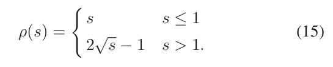

   其中$$r_B$$和$$r_C$$分别是IMU和视觉的测量残差‘B’是所有IMU测量的集合，‘C’是当前窗口中被观测到两次以上的特征集合，$$\{r_p,H_p\}$$​是边缘化中得到的先验信息，使用Ceres求解该非线性问题

   [^边缘化]: Marginalization，或者Schur消元，将H矩阵的右上块消去，分离出一组变量单独求解后再解另一组变量，目的是利用右下块是对角阵容易求逆的特性
   [^为什么消去右上块]: 因为一般情况下，路标的数量远大于相机变量的数量，即右下块的维度远大于左上块，因此要保留右下块，所以消去右上块

   

2. ##### IMU测量残差

   考虑滑动窗口中连续的两帧$$b_k和b_{k+1}$$，IMU测量的预积分可以被定义为：

   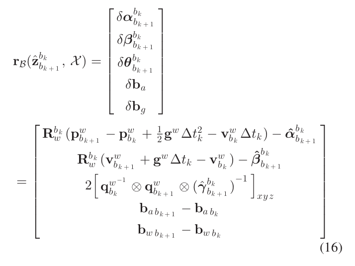

   类似《自动驾驶....》的式4.7，这里只是这样定义而已，并不是真的表示速度或者位置的偏差。（这里其实和4.7式有一定的相似性，可以对照理解），

   

   - $$[·]_{xyz}$$从四元数中提取向量部分；

   - $$[\hat\alpha_{b_{k+1}}^{b{_k}},\hat\beta_{b_{k+1}}^{b{_k}},\hat\gamma_{b_{k+1}}^{b{_k}}]$$是两个连续图详间的预积分测量

   - 剩下两项是加速度计偏置和陀螺仪偏置

   

3. ##### 视觉测量残差

   与传统的鱼眼相机将重投影误差定义在一个归一化的图像平面上不同，这里将相机的测量残差定义在一个单位球面上，几乎所有类型相机的光学，包括广角、鱼眼或全向相机，都可以模拟为连接单位球体表面的单位射线

   考虑在第$$i$$张图像中第一次观测到的第$$l$$个特征，第$$j$$幅图像中的特征观测的残差定义为:

   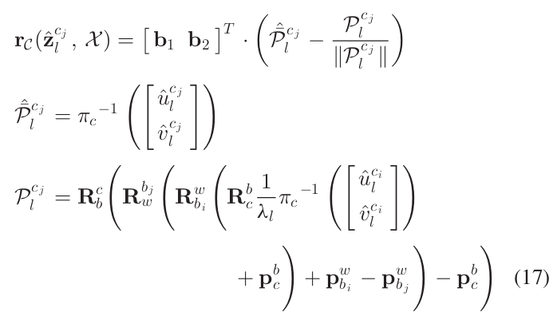

   

   | 变量                                  | 含义                                                     |
   | ------------------------------------- | -------------------------------------------------------- |
   | $$[\hat{u^{c_i}_l},\hat{v^{c_i}_l}]$$ | 第$$i$$张图像中，第$$l$$个特征的观测（第一次）           |
   | $$[\hat{u^{c_j}_l},\hat{v^{c_j}_l}]$$ | 第$$j$$张图像中，第$$l$$个特征的观测（同一个特征$$l$$）  |
   | $$\pi_c^{-1}$$                        | 利用摄像机内参将像素位置转换成单位向量的反投影函数       |
   | $$b_1和b_2$$                          | 是正切平面上两个任意选择的正交基                         |
   | $$P_l^{c_j}$$                         | 是（14）中用到的协方差，也被从像素坐标系转换到单位球面上 |

   正切平面：

   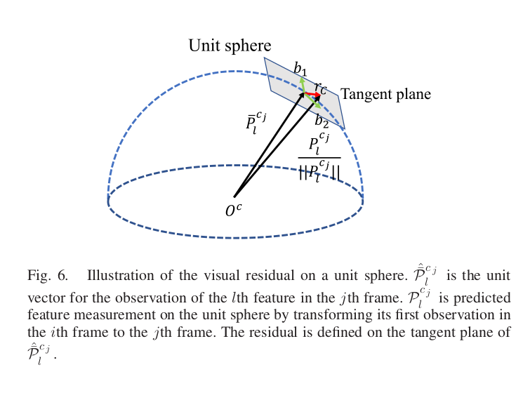

4. ##### 边缘化

   - 为了限制计算资源，这里引入边缘化。将IMU状态$$x_k$$和特征$$\lambda_l$$从滑动窗口中边缘化出去，**同时将对应边缘状态的测量值转换为先验**

   - 为了保持系统的稀疏性，不会将所有的非关键帧都边缘化

   - 该边缘化方案的目标是让滑动窗口中的关键帧保持空间分离，使得特征三角化时存在有效视差，并且最大化了在大激励下获得加速度计测量值的概率

   - 边缘化是利用Schur进行的，然后基于与移除状态相关的所有边缘化测量值构造一个新的先验并将其添加到现有的先验项中。

     [^Schur]: 和14讲中的边缘化方法一致

   - 边缘化导致了线性化点的早期固定，可能导致次优估计结果，这一点带来的负面影响可以接受

   - 流程：

     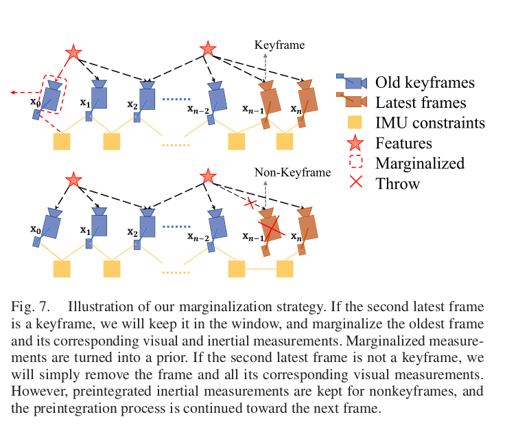

     | 情况             | 操作                                                         |
     | ---------------- | ------------------------------------------------------------ |
     | 新的帧是关键帧   | 保留新帧，边缘化最老的帧并将其转化为先验                     |
     | 新的帧不是关键帧 | 丢弃新帧以及所有与其对应的视觉测量，保留IMU预积分，并继续积分过程，直到下一个关键帧 |

     

5. ##### *用于摄像机速率状态估计的纯运动视觉惯性BA

   **思路**

   1. 对于计算性能较低的设备，紧耦合的单目VIO不能实现摄像机速率输出，因此部署了一种轻量级的纯运动视觉惯性BA

   2. 损失函数和单目VIO相同，但是这里只对固定数量的最新IMU姿态和速度进行优化

      [^原先]: 对滑动窗口中所有的状态进行优化

   3. 将不想优化的参数作为常量，例如特征深度、外部参数、偏置和旧的IMU状态

   4. 使用所有的视觉和惯性测量来进行纯运动的优化

   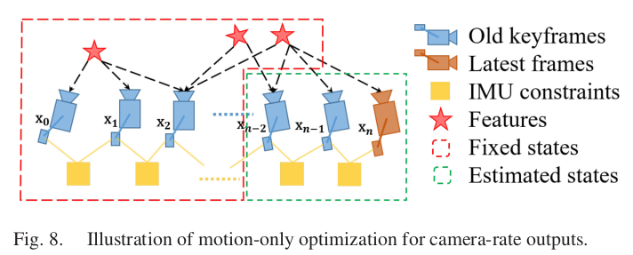

   ​	绿色的框即为“固定数量”

   **优点**

   - 状态估计比单帧PnP方法更加平滑

   - 纯运动的视觉惯性优化比正常方法快得多

     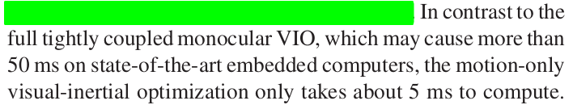

     

6. ##### IMU前向传播以达到IMU速率状态估计

​		IMU测量的速度远高于视觉测量。虽然我们的VIO频率受到图像捕获频率的限制，<u>但是可以将带有最近IMU测量值的VIO估计直接进行传播，来达到接近IMU速率的性能</u>。高频状态估计可以作为回环检测的状态反馈。

[^理解]: 是想让VIO频率尽可能高，甚至接近IMU的测量频率

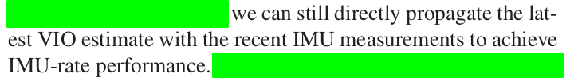


#### 重定位

​		滑动窗口和边缘化方案限制了计算复杂度，但也给系统带来了累积漂移，为了消除漂移，提出了一种与单目VIO无缝集成的紧耦合重定位模块，重定位过程从一个循环检测模块开始，该模块识别已经访问过的地方。然后建立回环检测候选帧和当前帧之间的特征级连接。这些特征的对应关系紧密地集成到单目VIO模块中，从而以最小计算代价得到无漂移状态估计。多个特征的多个观测直接用于重定位，从而提高了定位的精度和状态估计的平滑性。

​		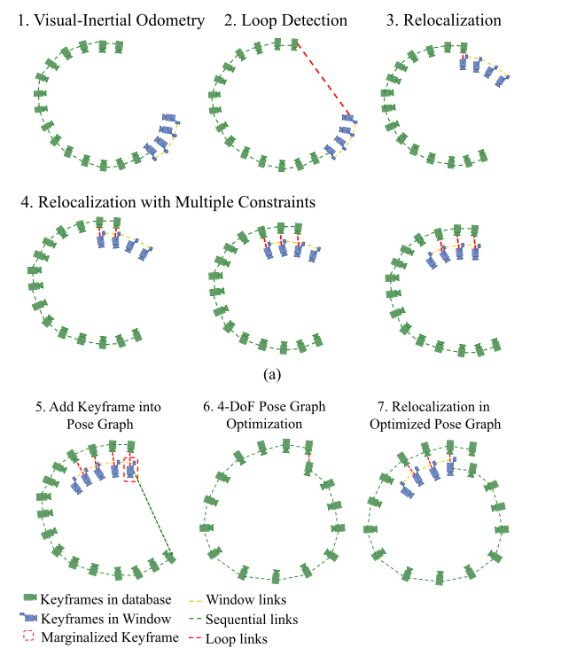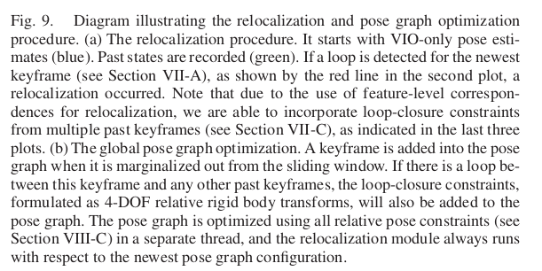

​		

| 步骤              | 作用、流程                                                   |
| ----------------- | ------------------------------------------------------------ |
| (a)重定位         | 在VIO状态估计中，过去的状态被记录下来；<br />如果在新的帧中检测到了回路，就认为发生了一次重定位；<br />将回路的回环约束加入多个过去的关键帧 |
| (b)全局位姿图优化 | 当一个关键帧被边缘化出滑动窗口后，就会被加入全局位姿图<br />如果这个帧和过去的帧存在回环，那么这个回环约束也会被加入全局位姿图<br />位姿图使用所有相关的姿态约束进行优化并在一个单独的线程中运行<br />重定位模块总是根据最新的位姿图运行 |


------

1. ##### 回环检测

   使用DBoW3【14讲，回环检测部分也用DBoW3】

   

2. ##### 特征恢复

   - 当检测到回路时，通过检索特征对应关系建立局部滑动窗口与回环候选帧之间的连接

   - 通过BRIEF描述子匹配找到对应关系

   - 直接描述子匹配可能会造成大量异常值。为此，使用两步[RANSAC](https://zhuanlan.zhihu.com/p/45532306)进行几何异常值剔除

     1.  2D-2D：基本矩阵检验。利用当前图像中检索到的特征的二维观测和回环候选图像进行基本矩阵检验。

     2.  3D-2D：PNP检验。基于特征在局部滑动窗口中已知的三维位置，以及回环候选图像中的二维观测，进行PNP检验。

        [^RANSAC]: 随机一致性采样：主要解决样本中的外点问题，最多可处理50%的外点情况，过反复选择数据中的一组随机子集来达成目标

        

   异常值去除后，将该候选帧视为正确的循环检测并执行重定位。

   

3. ##### 紧耦合重定位

   重定位过程有效地使单目VIO维持的当前滑动窗口与过去的位姿图对齐。在重定位过程中，我们将所有回环帧的位姿作为常量。利用所有IMU测量值、局部视觉测量和从回环中提取特征对应值，共同优化滑动窗口。我们可以轻松地为回环帧v观察到的检索特征编写视觉测量模型，使其与VIO中的视觉测量相同，如(17)所示。这两个视觉模型之间唯一的区别是，如果是第一次重定位，则直接从上一个里程计获得输出，否则就从位姿图中获得。为此，在（14）中加入回环项：

   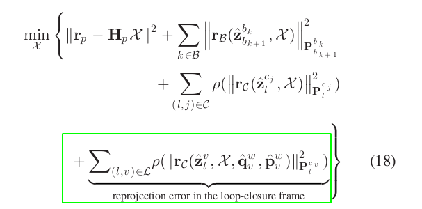

   其中，$$L$$是回环帧中检索到的特征的观测集，$$(l,v)$$是回环帧v中观测到的第l个特征。

   需要注意的是，尽管损失函数有些许区别，但是其维度保持不变，因为回环帧中的位姿被视作常数。当用当前滑动窗口建立多个回环时，我们同时使用来自所有帧的所有回环特征对应进行优化。这就为重定位提供了多视角的约束，从而提高了定位的精度和平滑性。请注意，**过去的姿态和回环帧的全局优化发生在重定位之后**


#### 全局位姿图优化和地图重用

重新定位后，使用额外的位姿图优化步骤，以确保过去位姿集注册到全局一致的配置中。

1. ##### 四个累计漂移

   由于视觉惯性的建立使翻滚角和俯仰角完全可观测，累积漂移只发生在四个自由度(x，y，z和yaw)。为此，我们忽视对无漂移翻滚和俯仰状态的估计，只进行了四自由度位姿图的优化

   

2. ##### 将关键帧加入位姿图

   当关键帧从滑动窗口被边缘化时，它将被添加到位姿图中。这个关键帧在位姿图中作为顶点，它通过两种类型的边与其他顶点连接：

   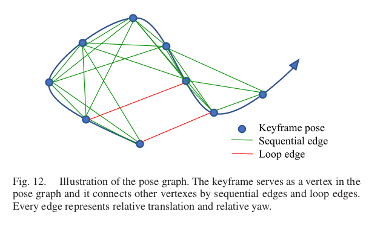

   1. 顺序边：表示两帧之间（当前帧和之前帧）的相对变换，由VIO直接得到

      考虑到新边缘化的关键帧$$i$$及其先前的一个关键帧$$j$$，顺序边只包含相对位置$$\hat{p}_{i,j}^i$$和偏航角$$\hat{\psi}_{i,j}$$:

      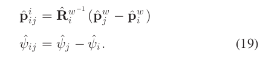

   2. 回环边：

      如果新边缘化的关键帧有一个回环连接，它将与回环帧通过一个回环边在位姿图图中连接。同样，闭环边缘只包含与(27)相同定义的四自由度相对位姿变换。回环边的值由重定位结果得出。

      

3. ##### 四自由度位姿图优化

   将帧$$i$$和$$j$$之间边的残差定义为：

   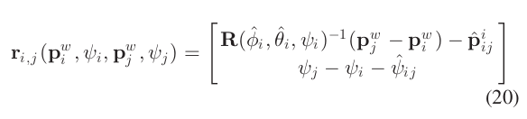

   通过最小化以下代价函数，对顺序边和回环边的整个图进行优化：

   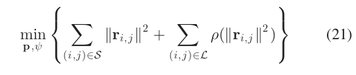

   其中S是所有顺序边的集合，L是回环边的集合。尽管紧耦合的重定位已经有助于消除错误的回环，但我们添加了另一个Huber范数 *ρ*(·)，以进一步减少任何可能的错误回环的影响。相反，我们不对顺序边使用任何鲁棒范数，因为这些边是从VIO中提取出来的，VIO已经包含了足够多的外点排除机制。

   位姿图优化和重定位(VII-C)异步运行在两个独立的线程中。以便在需要重定位时，能立即使用最优化的位姿图。同样，即使当前的位姿图优化尚未完成，仍然可以使用现有的位姿图配置进行重新定位。这一过程如图9(b)所示:

   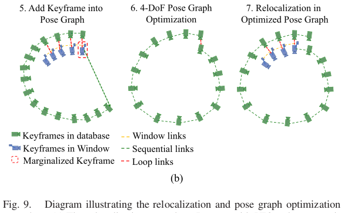

   [^图9]: 在图9b的解释中提到了双线程（上文）

   

4. ##### 位姿图融合

   位姿图不仅可以优化当前的地图，还可以将现在的地图和之前建立的地图进行融合。如果已经加载了以前建立的地图并且检测到它和现在的地图之间存在环路连接，则将其融合起来；由于所有的边都是相对约束，所以，位姿图优化自动地利用环路连接将两幅地图融合起来，如图，当前地图被回环边拉进之前的地图，每个边和每个顶点都是（relative variables），因此只要固定第一个顶点即可。

   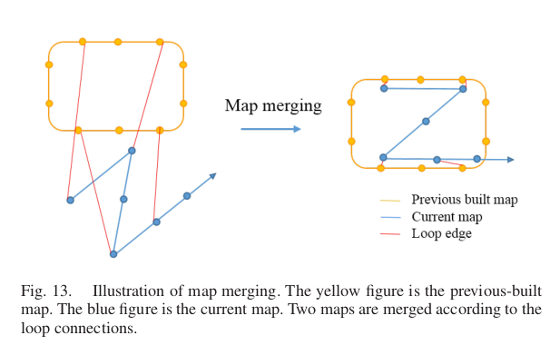

5. ##### 位姿图保存

6. ##### 位姿图加载

   

7. ##### [位姿图管理](https://blog.csdn.net/qq_41839222/article/details/85683373)

   随着行程距离的增加，位姿图的大小可能会无限增长，从而限制了长时间系统的实时性。为此，我们实行了一个下采样过程，将位姿图数据库保持在有限的大小。所有具有回环约束的关键帧都将被保留，而其他与相邻帧过近或方向非常相似的关键帧可能会被删除。关键帧被移除的概率和其相邻帧的空间密度成正比。

   [^博客中的内容]: 在原论文中没有找到相关的下采样过程，后续结合代码判断


#### 实验结果

------


#### 总结和展望

------


#### 附录

------

